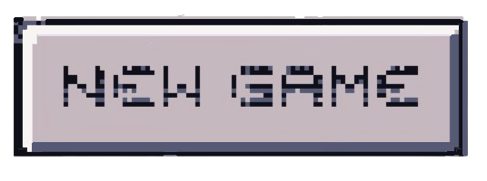
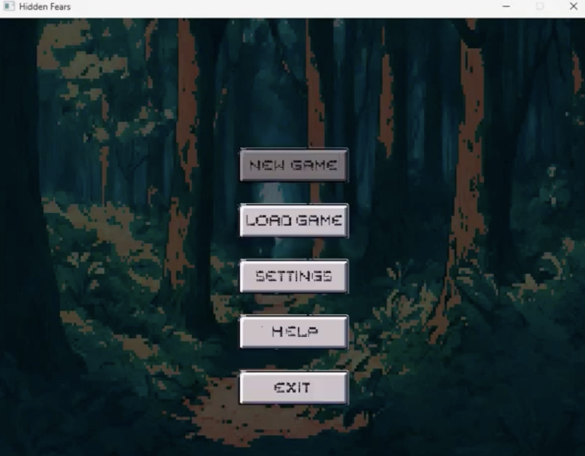
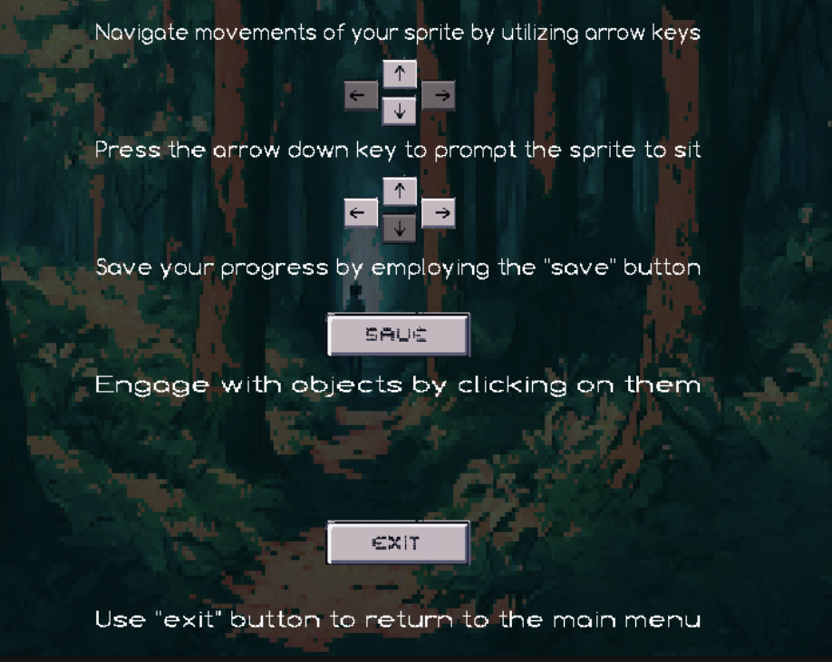
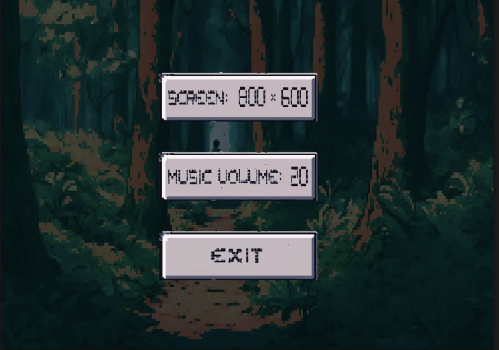
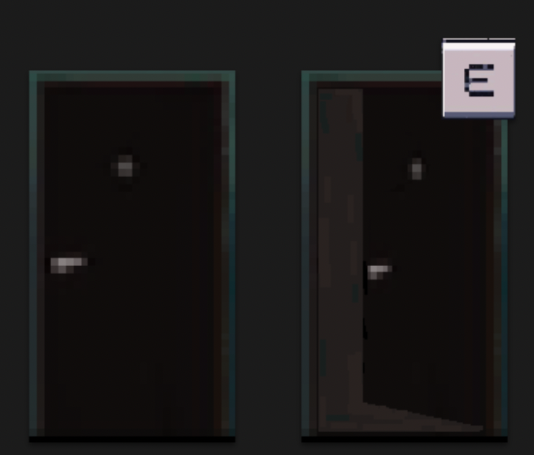

<h1 align="center" id="title">EndGame</h1>

Step into EndGame the final project of Innovation Campus intense C Marathon. This psychological horror with detective elements invites you to unravel a tense and mysterious storyline. Prepare to face dark secrets unsettling truths and a world full of suspicion. Are you ready for the challenge?

<h2>🚀 Demo LetsPlay</h2>

[https://youtu.be/K7M7fL8mtmI?si=c5Z14PLKQX4QhIw6](https://youtu.be/K7M7fL8mtmI?si=c5Z14PLKQX4QhIw6)

<h2>🐸 Our Team:</h2>

* Olesia Malanchuk
* Bohdan Liashenko
* Olesia Shynkarenko
* Maksym Shkolnyk
* Vladyslav Tesliuk
* Vitaliy Zozulia
  
<h2>🧐 Features</h2>

Here are some of the project's best features:

*   Custom-designed animated characters (sprites)
*   Original background music composed specifically for the game
*   Seamless transitions between different locations
*   Adjustable screen resolution for optimized gameplay
*   Modifiable background music to match the in-game atmosphere
*   Engaging interactive dialogues with NPCs
*   Dynamic day and night cycles
*   Transitioning through doors to access various locations
*   A user-friendly in-game menu with easy navigation
*   Complete volume control for music and sound effects

<h2>📷 Project Screenshots</h2>

<h3>Menu Interface</h3>

The menu buttons dynamically change color when clicked, providing visual feedback to users:

    
    

Complete Menu Interface:

<h3>Help Page</h3>

The help page provides detailed instructions and rules for the game:

<h3>Settings Interface</h3>

Players can adjust the volume and screen resolution from the settings page:

<h3>Locations and Characters</h3>

Our game features contiguous locations, allowing smooth transitions between different environments:

  
    

The character has the ability to crawl, adding a layer of immersive movement mechanics:

Interactive dialogues are a core feature of the game, enriching player engagement:

    
    

Doors in the game are interactive. As you approach the door, it opens automatically, and pressing the 'E' key will transport the player to the next location:

<h3>Game Ending</h3>

The final scene of the game:

  
  
<h2>💻 Built with</h2>

Technologies used in the project:

*   SDL2 Library
*   C Programming Language

